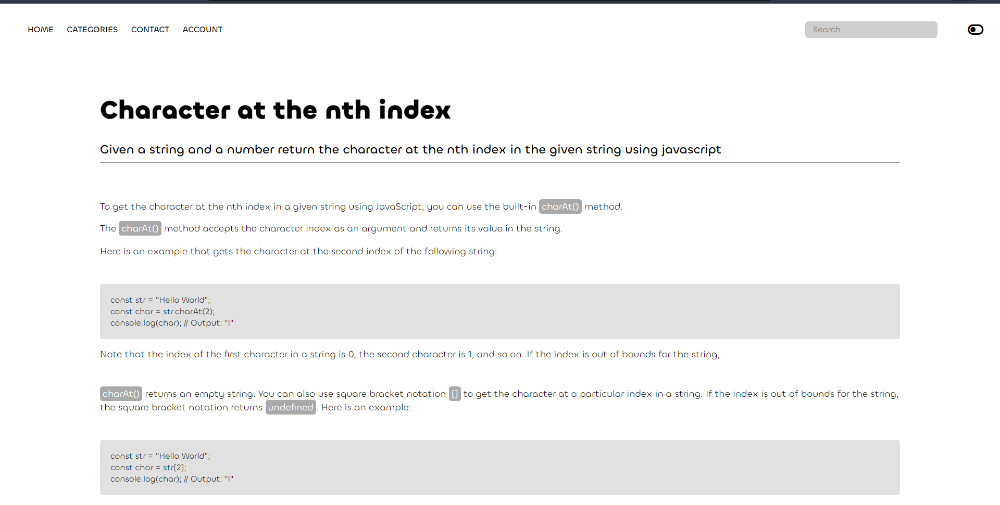
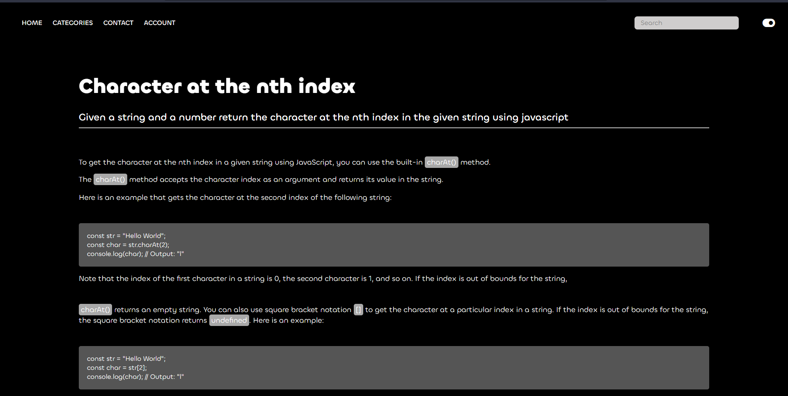
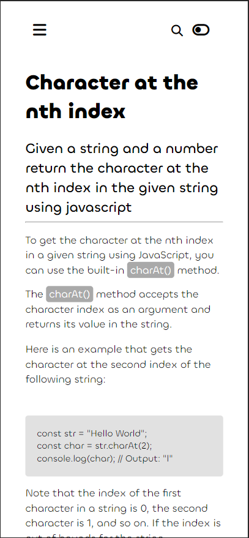
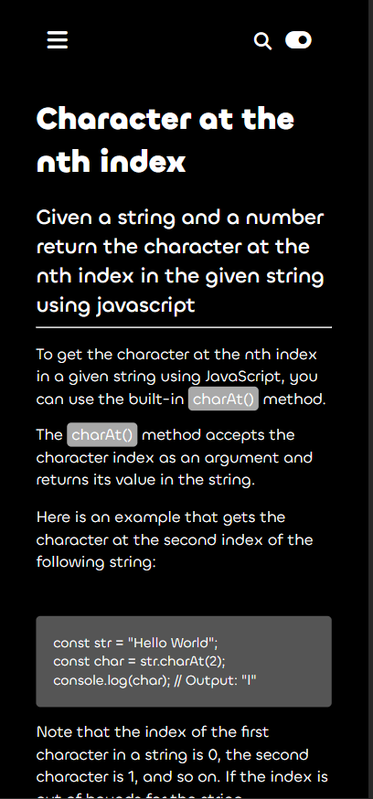

# dark-light-toggle
A simple HTML, CSS and JS website that displays how dark-mode to light-mode toggle works as well as how responsive navbar works.
---

This Project is about how one could use HTML, CSS and JS to implement a simple `dark theme toggle` implementation.

Preview - light mode

Preview - dark mode

Preview - Responsive light mode

Preview - Responsive dark mode

Preview - Responsive NavBar

---

This should help you understand how to implement `Responsive Navbar` as well as `Dark theme toggle`.